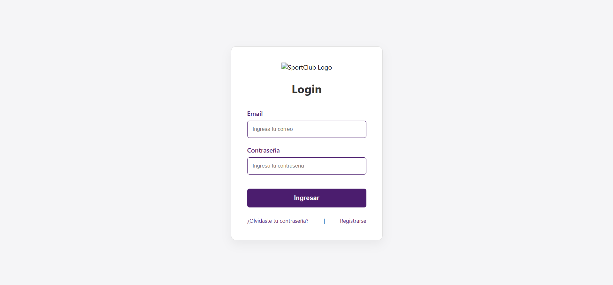
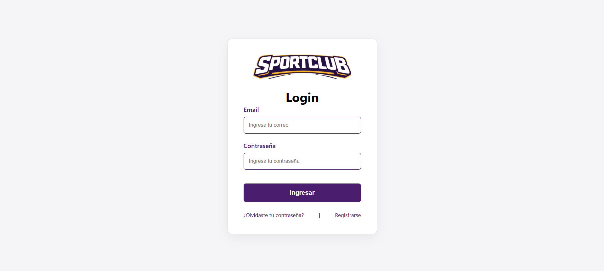

# Documentación de Uso de IA - Proyecto Login SportClub

**Estudiante:** Sofia Veliz
**Fecha que se empezo:** 24 de marzo de 2026
**Herramienta utilizada:** Gemini 3 Flash

## 1. Prompts utilizados:
* "Desarrollar una página de Login en HTML5 y CSS3."
* "Creación de estilos CSS aplicando el modelo de cajas (margin, padding, border)."

## 2. Resultado generado por la IA:
**Estructura de codigo HTML:

<!DOCTYPE html>
<html lang="es">
<head>
    <meta charset="UTF-8">
    <title>Login Page</title>
    <link rel="stylesheet" href="style.css">
</head>
<body>
    

        
        <form>
            <input type="email" placeholder="Email">
            <input type="password" placeholder="Password">
            <button type="submit">Ingresar</button>
        </form>
        

            <a href="#">Recuperar</a>
            <a href="#">Registrarse</a>
        

    

</body>
</html>

**Estructura de codigo CSS:

body {
    background-color: #f4f4f9;
    display: flex;
    justify-content: center;
    align-items: center;
    height: 100vh;
}
.login-card {
    background-color: white;
    padding: 20px;
    border: 1px solid #ccc;
    text-align: center;
}
input {
    width: 100%;
    margin-bottom: 10px;
}

## 3. Modificaciones:

HTML5:

Mejora de Etiquetas: Cambié los 
 genéricos por etiquetas semánticas <main> y <section>. Esto mejora la accesibilidad y la estructura del sitio.
Organización: Reestructuré el proyecto en carpetas. Modifiqué las rutas para que el CSS se lea desde css/style.css y las imágenes desde image/.
Documentación de Aprendizaje: Escribí comentarios detallados en cada línea del HTML (explicando viewport, charset, label for, etc.) para asegurar la comprensión de la sintaxis.

CSS3:

Reset de Caja: Implementé el selector universal * con box-sizing: border-box. Esto es clave para que el padding de los inputs no desborde el ancho del contenedor.
Identidad Visual: Personalicé la paleta de colores usando el Morado SportClub (#4B1D6E) y el Amarillo (#FDB813) para los estados activos, respetando el boceto del cliente.
Centrado con Flexbox: Perfeccioné el uso de display: flex en el body para que el login quede perfectamente centrado en cualquier tamaño de pantalla (celular o monitor).
Experiencia de Usuario (UX): Añadí una transition: 0.3s en el botón de ingreso. Esto hace que el cambio de color al pasar el mouse (hover) sea fluido.

## 4. Resultados y Evidencia Visual:

Presento el proceso de validación y los ajustes realizados en la interfaz:

Paso 1: Corrección de rutas y visualización inicial
Se corrigió la etiqueta `` para que el logo sea visible.

Paso 2: Ajuste de dimensiones con CSS3
Se limitó el tamaño del logo y se aplicó el centrado manual para evitar desbordamientos.

Paso 3: Interfaz Final Terminada
Resultado final con el modelo de cajas aplicado, colores institucionales y tipografía legible.

## 5. Justificación:

1: Decidí separar el código en carpetas css/ para los estilos e image/. Esto lo hice para que el proyecto sea ordenado y no tener todos los archivos sueltos.
2: Usé Flexbox para que el login quede siempre en el centro, sin importar si lo mirás desde un monitor o un celular.
3: Usé Git para ir guardando mis versiones y no perder nada. Además, me aseguré de que el formulario no se pueda mandar vacío (usando required), para que el usuario no cometa errores al intentar entrar.

