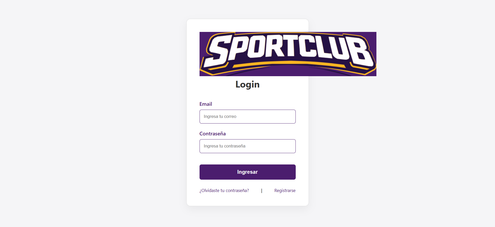
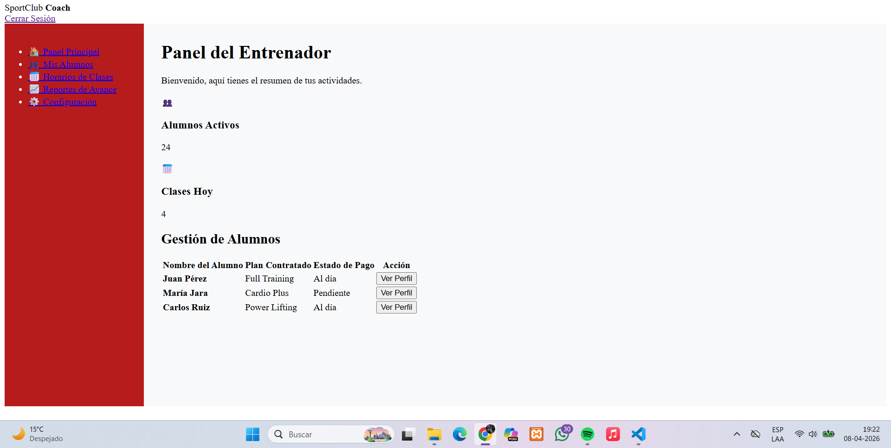
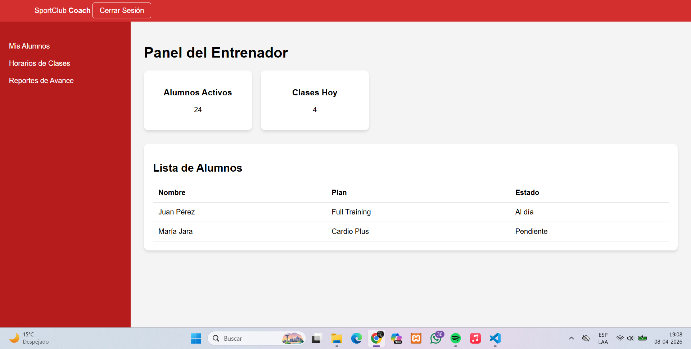
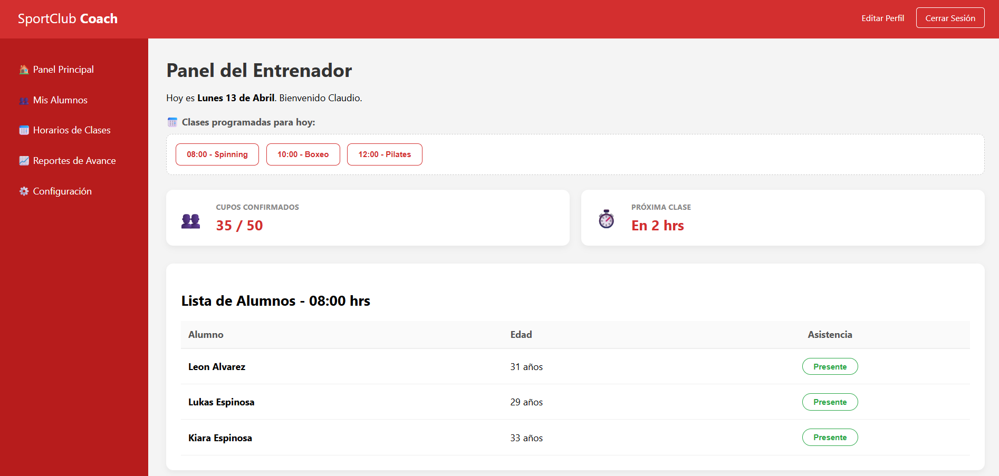
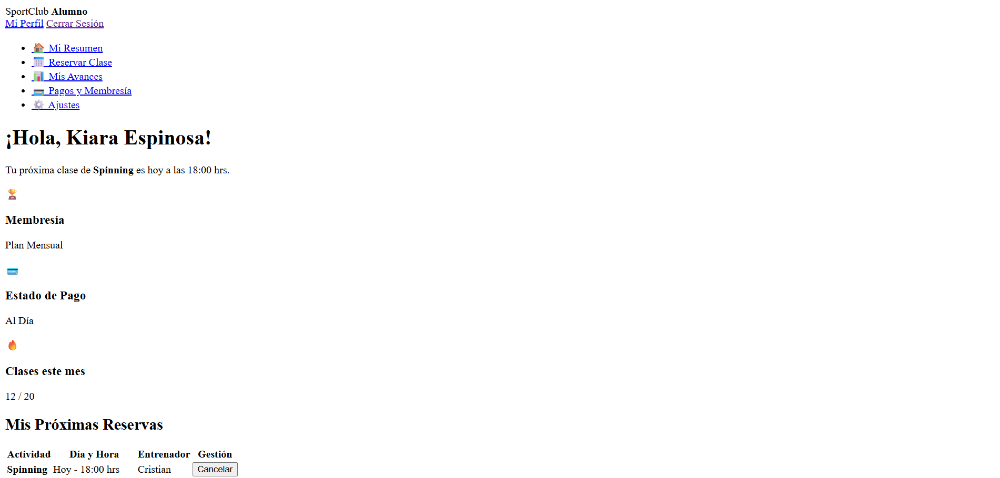
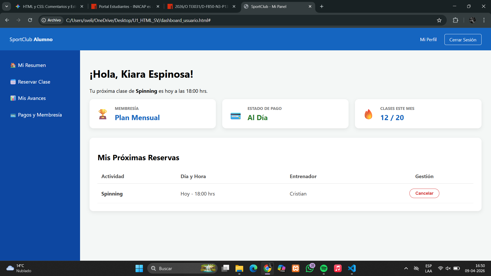
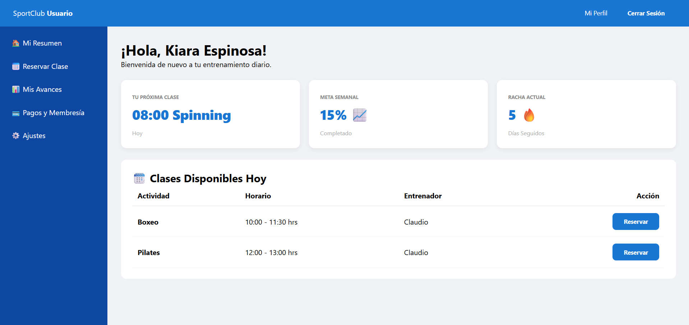

 Documentación de Uso de IA - Proyecto SportClub

Estudiante: Sofia Veliz
Fecha de inicio: 24 de marzo de 2026
Herramienta utilizada: Gemini 

1. Prompts utilizados:

"Desarrollar una página de Login en HTML5 y CSS3."
"Creación de estilos CSS aplicando el modelo de cajas (margin, padding, border)."
"Agregar botón de volver y cambiar textos a español (Iniciar sesión)."
"Crear estructuras para páginas de Registro y Recuperación de contraseña."

2. Resultado inicial generado por la IA:
La IA proporcionó una estructura base funcional con un formulario simple, centrado básico con Flexbox y un diseño de tarjeta (card) estándar.

3. Modificaciones y Mejoras Realizadas:

HTML5 (Semántica y Estructura):

Mejora de Etiquetas: Cambié los `
` genéricos por etiquetas semánticas `<main>` y `<section>`. Esto mejora la accesibilidad y el SEO.

Navegación: Implementé un botón de "Volver" con rutas relativas para mejorar la experiencia de usuario (UX).

Localización: Traduje toda la interfaz al español ("Iniciar sesión", "Ingresar", etc.) siguiendo los requerimientos del profesor.

Organización: Reestructuré el proyecto en carpetas. Modifiqué las rutas para que el CSS se lea desde `css/style.css` y las imágenes desde `image/`.

CSS3 (Diseño y Modelo de Cajas):

Reset de Caja: Implementé el selector universal `*` con `box-sizing: border-box` para un control total de las dimensiones.

Identidad Visual: Personalicé la paleta de colores usando el **Morado SportClub (#4B1D6E)** y el **Amarillo (#FDB813)** para los estados activos.

Centrado con Flexbox: Perfeccioné el uso de `display: flex` en el body para un centrado absoluto en cualquier dispositivo.

Feedback Visual: Añadí `transition: 0.3s` y efectos `:hover` en botones y enlaces para una navegación más fluida.

4. Resultados y Evidencia Visual:

Presento el proceso de validación con las rutas actualizadas a la carpeta `./docs/`:

Paso 1: Corrección de rutas y visualización inicial
Se corrigió la etiqueta `` para que el logo sea visible vinculándolo a la carpeta `image/`.

Paso 2: Ajuste de dimensiones con CSS3
Se limitó el tamaño del logo y se aplicó el centrado manual para evitar desbordamientos.

Paso 3: Interfaz Final y Nuevas Páginas
Resultado final con el modelo de cajas aplicado, textos en español y navegación integrada.

5. Justificación Técnica:

Orden: Decidí separar el código en carpetas css/  image/ y mover la documentación a docs/. Esto facilita el que se entienda mejor el orden del proyecto.

Diseño Responsivo: Usé Flexbox para que el login sea "Mobile First", viéndose bien tanto en computadoras como en celulares.

Control de Versiones: Usé Git para mantener un historial de cambios. Además, aseguré la integridad de los datos usando el atributo require en todos los campos obligatorios del formulario.

Estructura del Proyecto SportClub landing page-dashboard_coach-dashboard_usuario 09/04/2026

Archivos Actuales

login.html: Interfaz de acceso (antes index.html).
register.html: Formulario de nuevos usuarios.
recover.html: Recuperación de cuenta.
css/style.css: Estilos globales.
image/: Carpeta de recursos visuales.
docs/: Carpeta del uso de la IA.md.

Próximos Pasos

Crear `index.html` (Nueva Landing Page motivacional).
Implementar Dashboards por perfil (Usuario, Coach, Admin).

Desarrollo: Proyecto SportClub

1. Evolución de la Landing Page

Estado Inicial (Sin Estilos): Elementos sin jerarquía visual ni contenedores.
[Landing Inicial](intento1delanding.png)

Estado Final (Diseño Moderno): Implementación de sección "Hero" y tarjetas de Misión/Visión con sombras.
[Landing Final](formafinallanding.png)

2. Dashboard del Entrenador (Coach)

El desarrollo del panel del entrenador pasó por una fase crítica donde la falta de una estructura CSS robusta impedía la usabilidad del sistema. A continuación, se detallan los fallos y las correcciones aplicadas.

Análisis de Errores 
En la versión inicial, el dashboard presentaba un fallo de renderizado total debido a:

Ausencia de Layout Principal: Los elementos (aside, main) se comportaban como bloques estándar, apilándose uno sobre otro sin orden.

Falta de Normalización de Estilos: Se visualizaban viñetas de lista (<li>) y enlaces azules subrayados, lo que indica que el CSS no estaba cargando o no incluía un "reset".

Tablas Desbordadas: Al no tener un contenedor con un ancho definido, la lista de alumnos perdía su formato tabular.

Comparativa de Código: El "Antes" y el "Después"

Código con Errores (Causa la caída del diseño)
Este código carece de la propiedad display: flex, lo que hace que el sidebar no se posicione a la izquierda del contenido.

/* ERROR: Sin contenedor flex, el diseño se rompe verticalmente */
aside {
    background-color: #D32F2F;
    width: 250px;
}
main {
    padding: 20px;
}
/* No hay control sobre cómo interactúan estos dos elementos */

Solucion realizada:

/* SOLUCIÓN: Flexbox Layout */
.dashboard-container {
    display: flex; /* Alinea sidebar y contenido de lado a lado */
    min-height: 100vh; /* Ocupa el 100% del alto de la ventana */
}

.sidebar-coach {
    width: 260px;
    background-color: #C62828; /* Rojo distintivo para el Coach */
    color: white;
}

.main-content {
    flex: 1; /* El contenido toma el resto del espacio disponible */
    background-color: #f4f7f6;
    padding: 40px;
}

Evidencias: Evolución del Dashboard Coach:

Estado Inicial:   Fallo de Renderizado El diseño se rompe verticalmente porque los elementos `aside` y `main` no tienen un contenedor con `display: flex`. 

Prototipo Intermedio:  Ajuste de Componentes Se implementan las tarjetas de métricas, pero el espaciado y la paleta de colores aún no son consistentes.

Diseño Final:  la solución Definitiva Aplicación de `flexbox` layout, tipografías corregidas y tabla de asistencia con estados dinámicos. 

3. Dashboard del Usuario:

A diferencia del perfil Coach, el Dashboard del Usuario se diseñó con una paleta de colores azul para diferenciar claramente los roles dentro del sistema. El reto técnico aquí fue mantener la consistencia de los componentes (tarjetas y tablas) usando la misma base de CSS.

Desbordamiento de Contenido: Al no existir un contenedor flexible, las tarjetas de "Membresía" y "Estado de Pago" se encimaban sobre el texto de bienvenida.

Iconografía Inconsistente: Se utilizaron emojis básicos en lugar de los activos finales (`.png`), lo que restaba profesionalismo a la interfaz.

 Solución y Evidencias Visuales:

Para solucionar esto, reutilizamos la clase `.dashboard-wrapper` con `display: flex`, asegurando que el Sidebar azul se mantuviera fijo a la izquierda mientras el contenido escalaba correctamente.

Estructura Base:  Sin estilos, los elementos HTML se renderizan en orden de flujo vertical. 

Primeros Estilos:  Implementación de Flexbox, Se visualiza la separación del Sidebar y el Main. 

Versión Final:  Diseño pulido con sombras (`box-shadow`), tarjetas alineadas y tabla de clases disponibles. 

Comparativa de Identidad Visual:

Se estableció un sistema de diseño basado en roles:

Coach: Sidebar Rojo (#C62828) 
Usuario: Sidebar Azul (#1976D2) 

